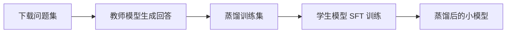

# 模型蒸馏入门实验

用 **Qwen2.5-7B**（教师）生成训练数据，蒸馏到 **Qwen2.5-0.5B**（学生），学习大模型向小模型传递知识的基本流程。

## 什么是知识蒸馏？

知识蒸馏（Knowledge Distillation）的核心思想：让一个**小模型（学生）**模仿**大模型（教师）**的行为，在体积大幅缩小的同时，尽量保留大模型的能力。

```
大模型（教师）能力强、推理慢、占显存多
        ↓ 生成高质量回答
小模型（学生）学习这些回答
        ↓ 微调训练
小模型获得接近教师的表现，但更快、更轻
```

与直接微调的区别：

| 方式 | 数据来源 | 目标 |
|------|----------|------|
| 普通微调 | 人工标注或现有数据集 | 适应特定任务 |
| 知识蒸馏 | **教师模型生成的回答** | 让小模型模仿教师 |

本项目的蒸馏流程属于 **数据蒸馏**：先用教师模型批量生成回答，再拿这些「问题 + 教师回答」训练学生模型（SFT）。

## 整体流程



| 步骤 | 脚本 | 输入 | 输出 |
|------|------|------|------|
| 0. 环境配置 | `scripts/verify_env.py` | — | 确认 CUDA 可用 |
| 1. 下载资源 | `scripts/download.py` | Hugging Face | `models/`、`data/raw_questions.jsonl` |
| 2. 生成蒸馏数据 | `scripts/generate_distill_data.py` | 问题集 + 教师模型 | `data/distill_train.jsonl` |
| 3. 训练学生模型 | `scripts/train_student.py`（待实现） | 蒸馏数据 + 学生模型 | `models/student-distilled/` |

## 项目结构

```
test-drill/
├── models/
│   ├── teacher/          # Qwen2.5-7B-Instruct（教师，~15GB）
│   └── student/          # Qwen2.5-0.5B-Instruct（学生，~1GB）
├── data/
│   ├── raw_questions.jsonl    # 原始问题（1000 条中文指令）
│   └── distill_train.jsonl    # 教师生成的蒸馏训练集
├── scripts/
│   ├── download.py              # 下载模型与数据
│   ├── generate_distill_data.py # 教师生成蒸馏数据
│   └── verify_env.py            # 环境验证
├── environment.yml              # conda 依赖（不含 PyTorch）
└── requirements-torch.txt       # PyTorch cu128（RTX 50 系列必需）
```

> `models/` 已在 `.gitignore` 中忽略，不会提交到 Git。

## 环境要求

- Python 3.11
- NVIDIA GPU（建议 ≥ 16GB 显存）
- **PyTorch cu128**（RTX 50 系列 / Blackwell 架构必须用 CUDA 12.8 构建）

```powershell
conda create -n distill python=3.11 -y
conda activate distill
pip install -r requirements-torch.txt --index-url https://download.pytorch.org/whl/cu128
pip install -r environment.yml  # 或按 environment.yml 中的 pip 依赖安装
python scripts/verify_env.py
```

## 快速开始

### 1. 下载模型与数据

```powershell
conda activate distill

# 国内可选镜像
$env:HF_ENDPOINT = "https://hf-mirror.com"

# 建议分步下载
python scripts/download.py --data --student   # 数据 + 学生模型（小）
python scripts/download.py --teacher        # 教师模型（~15GB，耗时较长）
```

也可用新版 CLI：

```powershell
hf download Qwen/Qwen2.5-0.5B-Instruct --local-dir ./models/student
hf download Qwen/Qwen2.5-7B-Instruct --local-dir ./models/teacher
```

### 2. 教师模型生成蒸馏数据

教师模型读取 `raw_questions.jsonl` 中的每条 `instruction`，生成回答，写入 `distill_train.jsonl`。

```powershell
# 先试 50 条（约 15～20 分钟）
python scripts/generate_distill_data.py --limit 50

# 满意后跑全部，中断可加 --resume 续跑
python scripts/generate_distill_data.py --resume

# 显存紧张时（需 pip install bitsandbytes）
python scripts/generate_distill_data.py --quantize-4bit --limit 50
```

数据格式示例：

```json
{
  "index": 0,
  "instruction": "判断给定的文章是否符合语法规则...",
  "input": "",
  "output": "该文章开头的句子在语法上是正确的..."
}
```

其中 `output` 是**教师模型生成**的回答，将用于训练学生模型。

### 3. 训练学生模型（下一步）

使用 `distill_train.jsonl` 对学生模型做 SFT（监督微调），让学生学会模仿教师的回答风格与质量。训练脚本 `scripts/train_student.py` 待实现。

## 模型与数据说明

| 角色 | 模型 | 参数量 | 显存占用（推理） |
|------|------|--------|------------------|
| 教师 | `Qwen/Qwen2.5-7B-Instruct` | 7B | ~14GB（fp16）/ ~5GB（4-bit） |
| 学生 | `Qwen/Qwen2.5-0.5B-Instruct` | 0.5B | ~1GB |

| 数据 | 来源 | 说明 |
|------|------|------|
| `raw_questions.jsonl` | BelleGroup/train_1M_CN | 1000 条中文指令，只取问题部分 |
| `distill_train.jsonl` | 教师模型生成 | 问题 + 教师回答，即蒸馏训练集 |

## 常见问题

**Q: `raw_questions.jsonl` 里为什么曾经是 `\uXXXX` 而不是中文？**

`datasets.to_json()` 默认 `ensure_ascii=True`，会把中文转成 Unicode 转义。内容本身没问题，但可读性差。现在 `download.py` 已改为 UTF-8 + `ensure_ascii=False`，文件里直接显示中文。

**Q: `huggingface-cli` 报错？**

已弃用，请改用 `hf download` 或项目内的 `download.py`。

**Q: 教师生成很慢？**

7B fp16 在 16GB 显存上可能部分层 offload 到 CPU。安装 `bitsandbytes` 后使用 `--quantize-4bit` 可显著加速。全部 1000 条约需数小时，建议先用 `--limit 50` 验证效果。

**Q: 下载中断了怎么办？**

模型下载和蒸馏数据生成均支持断点续传，重新运行相同命令即可，无需删除已有文件。数据生成加 `--resume`。
